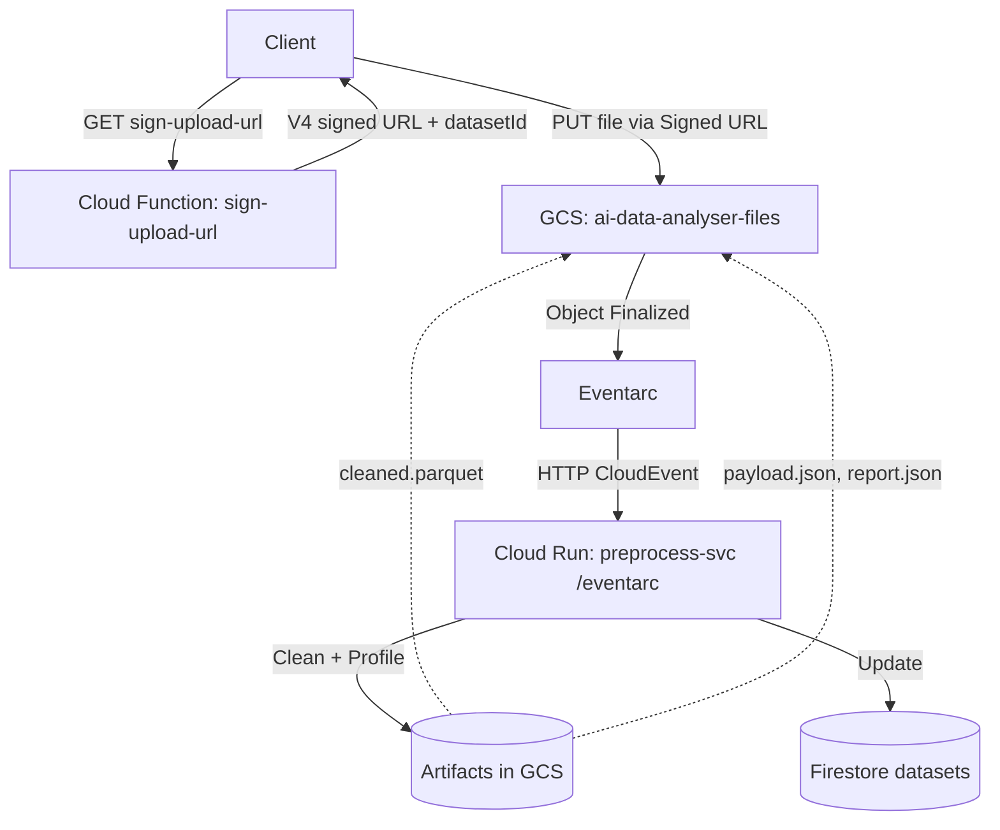

# AI Data Analyst – Progress Report

Date: 2025-10-03 01:47 (+02:00)

## Current Status
- **Preprocessing is fully functional**. Upload via signed URL triggers preprocessing; artifacts are generated and Firestore status advances to `ready`.
- **Frontend integrated (Auth + Upload + Chat SSE)**. Firebase Anonymous Auth, upload via signed URL, and chat SSE orchestrator are working end-to-end. Artifacts (`table.json`, `metrics.json`, `chart_data.json`, `summary.json`) are produced and signed for browser access.
- **CORS aligned for dev**. Dev runs on `http://localhost:5173`; functions allow Origin and lowercase headers in preflight. Frontend passes `sessionId` as a query param to avoid custom header preflight.
- **End-to-end smoke tests pass** using `test.ps1`.

## Deployed Components
- **Cloud Run service: `preprocess-svc`**
  - Framework: `FastAPI` in `backend/run-preprocess/main.py`.
  - Endpoints:
    - `GET /healthz` – lightweight health endpoint (service is private; unauthenticated calls may 403/404).
    - `POST /eventarc` – Eventarc target; parses CloudEvents in multiple delivery shapes (structured, binary, Pub/Sub push, and GCS notification compatibility).
  - Responsibilities:
    - Download raw file from GCS under `users/{uid}/sessions/{sid}/datasets/{datasetId}/raw/input.{csv|xlsx}`.
    - Run pipeline `backend/run-preprocess/pipeline_adapter.py` to clean and profile data.
    - Write artifacts:
      - `cleaned/cleaned.parquet`
      - `metadata/payload.json`
      - `reports/cleaning_report.json`
    - Update Firestore dataset document with `status: ready`, rows, columns, and artifact URIs.
  - Observability: integrates Google Cloud Logging (`cloud-logging: configured`).

- **Cloud Functions (Gen2): `sign-upload-url`**
  - Path: `backend/functions/sign_upload_url/main.py`.
  - Functionality: issues a V4 signed URL for direct browser PUT upload.
  - Security: uses IAM-based signing via impersonated credentials (no private key).
  - Behavior: creates initial Firestore dataset doc with `status: awaiting_upload` and `ttlAt`.

- **Cloud Functions (Gen2): `chat` (orchestrator, SSE)**
  - Path: `backend/functions/orchestrator/` (deployed and available; orchestration logic outside the scope of this stage).

- **Eventarc Trigger: `preprocess-trigger`**
  - Filters: `type=google.cloud.storage.object.v1.finalized`, `bucket=ai-data-analyser-files`.
  - Destination: Cloud Run `preprocess-svc` path `/eventarc` (region `europe-west4`).
  - Transport: Pub/Sub (managed subscription/topic).

- **Google Cloud Storage (GCS)**
  - Bucket: `ai-data-analyser-files`.
  - Structure per dataset:
    - `raw/input.csv` (or `.xlsx`)
    - `cleaned/cleaned.parquet`
    - `metadata/payload.json`
    - `reports/cleaning_report.json`

- **Firestore (Native mode)**
  - Collection path: `users/{uid}/sessions/{sid}/datasets/{datasetId}`.
  - Fields (subset): `status`, `rawUri`, `cleanedUri`, `payloadUri`, `reportUri`, `rows`, `columns`, `updatedAt`, `ttlAt`.
  - TTL Policy: Enabled on collection group `datasets` for field `ttlAt` (state: ACTIVE).

## Architecture & Design
- **Design principles**
  - Keep compute stateless and ephemeral; persist state/artifacts in Firestore + GCS.
  - Use direct-to-GCS uploads via signed URLs; minimize function runtime and egress.
  - Eliminate private keys; prefer IAM-based signing and workload identity.
  - Event-driven preprocessing via Eventarc to decouple upload from processing.

- **High-level flow**

- **Security & IAM**
  - Runtime Service Account: `${PROJECT_NUMBER}-compute@developer.gserviceaccount.com`.
  - Roles:
    - `roles/datastore.user` for Firestore access.
    - Bucket-scoped `roles/storage.objectAdmin` on `ai-data-analyser-files`.
    - `roles/eventarc.eventReceiver` for Eventarc delivery.
    - `roles/iam.serviceAccountTokenCreator` (self) for IAM-based signing.
    - GCS service account granted `roles/pubsub.publisher` for CloudEvents → Pub/Sub.
  - Cloud Run service is private; HTTP access requires identity.

  - Script: `backend/deploy.ps1` handles:
    - Enabling APIs.
    - Deploying Cloud Run `preprocess-svc` with buildpacks (Python 3.12).
    - Setting env vars: `FILES_BUCKET`, `GCP_PROJECT`, `TTL_DAYS`.
    - Creating/Updating Eventarc trigger.
  - Deploying Cloud Functions `sign-upload-url` and `chat`.
  - Printing service URLs and running a smoke test.

## Verification
- **Smoke test**: `test.ps1`
  - Health probe (best-effort; service is private so 404/403 is expected).
  - Requests signed URL, uploads sample CSV, waits 30s, lists artifacts, and prints Firestore `status`.

- **Logs**
  - Cloud Run: use `gcloud logging read 'resource.type="cloud_run_revision" AND resource.labels.service_name="preprocess-svc"' --limit=100 --freshness=1h`.
  - Indicators of successful processing: `preprocess_complete` log entry and 204 response to `/eventarc` after processing.

## Operational Notes
- **Known non-blocker**: `/healthz` unauthenticated requests return 404/403 because the service is private. This does not affect Eventarc-triggered processing.
- **Resource tuning** (optional): set Cloud Run `--concurrency=1` and increase `--memory` (e.g., 1Gi) if needed for heavy files.
- **Idempotency** (optional): skip reprocessing if `cleaned/` already exists.
- **Bucket lifecycle** (optional): add object TTL for `users/` prefix to match Firestore TTL.

## Recent Changes (Changelog)
- **2025-10-03**
  - Frontend
    - Integrated AuthContext with Firebase Anonymous Auth; `.env.example` added; dev server port set to `5173`.
    - File upload wired to `sign-upload-url`; removed `X-Session-Id` header in favor of `sessionId` query param.
    - Chat SSE integrated; added robust spinner stop in `App.tsx` `finally` after stream ends; fixed file input reset in `ChatInput.tsx`.
  - Backend
    - CORS preflight updated to include lowercase `authorization`, `content-type`, `x-session-id` in both functions.
    - Orchestrator worker now coerces non-dict returns (DataFrame/list) and fills missing keys to avoid `run() must return a dict` surfacing to users.
  - Deploy
    - `deploy-analysis.ps1` now uses `--env-vars-file` with YAML files (`env.sign-upload-url.yaml`, `env.chat.yaml`) to reliably pass `ALLOWED_ORIGINS` on Windows PowerShell.
    - Printed function URLs unchanged; redeploy confirmed.

- **2025-10-03 (later)**
  - Frontend (Phase 1)
    - Implemented assistant placeholder message pushed immediately upon send with `kind: "status"` and live status updates mapped from SSE events (`validating`, `generating_code`, `running_fast`, `summarizing`, `persisting`).
    - Upgraded message model to a discriminated union (`text|status|error|table|chart`).
    - Added `TableRenderer.tsx` and `ChartRenderer.tsx` (Recharts) and updated `ChatMessage.tsx` to dispatch per kind.
    - On `done`, convert placeholder to summary text and append separate table and chart bubbles when present.
  - Backend (Phase 1)
    - Fixed artifact URL signing in `functions/orchestrator/main.py` general path: now signs `uris_gs` → `uris` before Firestore write and SSE `done`.
  - Hosting/Deploy (Phase 1)
    - Added Firebase Hosting rewrites for `/api/sign-upload-url` and `/api/chat` to Functions Gen2 in `europe-west4`.
    - Parameterized `--allow-unauthenticated` in `backend/deploy-analysis.ps1` via `ALLOW_UNAUTHENTICATED` env var (default off) for production auth at the edge via Hosting.

- **2025-10-03 (Phase 2)**
  - Frontend
    - Added Cancel button wired to `AbortController`; converts assistant placeholder to `Cancelled.` and resets typing.
    - Fixed JSX mismatches in `App.tsx` introduced during edits.

- **2025-10-03 (Phase 3)**
  - Backend
    - Refined exception handling in `functions/orchestrator/main.py`: specific `json.JSONDecodeError` and `GoogleAPICallError` handling with clearer error codes.
    - Added final result validation/coercion before persistence (ensure `summary` non-empty fallback; shape guards for `table`, `metrics`, `chartData`).
  - Ops
    - Added GCS lifecycle rule: delete objects under `users/` prefix after 1 day via `deploy-preprocess.ps1`.

- **2025-10-03 (Phase 4)**
  - Frontend
    - Implemented Firestore chat persistence helpers in `frontend/src/services/firestore.ts` (ensure session, update dataset, save user messages, load last ~5 sessions with messages).
    - Integrated persistence into `App.tsx` (create session on new chat/ensure, update datasetId after upload, save user messages, hydrate recent sessions on auth ready).
    - Added `frontend/.env.example`; development now recommends `.env.development`. Production builds default to `/api/*` endpoints via Hosting rewrites when env vars are unset.
  - Tests
    - Enhanced `backend/test.ps1`: SSE smoke test now checks that `done` contains HTTPS signed URLs (`uris.*`) and attempts to fetch them.
- **2025-10-01**
  - Backend Performance – Step 1 implemented.
    - Orchestrator (`backend/functions/orchestrator/main.py`)
      - Switched to base64 IPC: downloads `cleaned.parquet` as bytes and passes to worker over stdin JSON (`parquet_b64`). Fallback to file path via `ORCH_IPC_MODE=filepath`.
      - Uses `payload.json` keys (`sample_rows`, `columns`) for LLM context; avoids parquet `head()` when payload exists.
      - Added metadata-only fast path: schema/columns/row-count questions are answered from payload without loading parquet.
      - Parallelized GCS result uploads (table/metrics/chart_data/summary) with `ThreadPoolExecutor`.
      - Fused Gemini call: `generate_code_and_summary()` returns code + short summary in one request.
    - Worker (`backend/functions/orchestrator/worker.py`)
      - Accepts `parquet_b64` (base64) and decodes into an in-memory DataFrame; retains `parquet_path` fallback.
    - Gemini client (`backend/functions/orchestrator/gemini_client.py`)
      - Added `generate_code_and_summary()` with structured parsing; gated by `GEMINI_FUSED` env (default on).
    - Preprocess service (`backend/run-preprocess/main.py`)
      - Full in-memory I/O: `download_as_bytes()` in, `upload_from_file(BytesIO)` out; no `/tmp` in the happy path.
      - Parallelized uploads of cleaned parquet, `payload.json`, and `cleaning_report.json`.
    - Pipeline adapter (`backend/run-preprocess/pipeline_adapter.py`)
      - Added `process_bytes_to_artifacts(data, kind, ...)` to mirror file-based API for in-memory processing.
    - Deployment scripts
      - `backend/deploy-preprocess.ps1`: set `--cpu=2 --memory=2Gi --concurrency=10` and `PREPROCESS_ENGINE=polars` (engine switch to be implemented in Step 2).
      - `backend/deploy-analysis.ps1`: set `ORCH_IPC_MODE=base64` and `GEMINI_FUSED=1` for `chat` function.
    - Flags and rollback
      - `ORCH_IPC_MODE=base64|filepath`, `GEMINI_FUSED=1|0`, `PREPROCESS_ENGINE=polars|pandas` (engine wiring in Step 2).
    - Observability
      - Parallelized upload steps; will add stage timing benchmarks in a follow-up.

- **2025-10-01**
  - Backend Performance – Step 2 implemented.
    - Preprocess engine defaulted to Polars for CSV via `run-preprocess/pipeline_adapter_polars.py`; Excel remains via pandas.
    - Extracted `process_df_to_artifacts()` in `run-preprocess/pipeline_adapter.py` to centralize cleaning/payload logic (shared by both adapters).
    - Dependencies: added `polars[xlsx]==1.7.1`, aligned `numpy==2.0.2` in `run-preprocess/requirements.txt`.
    - Deployed new `preprocess-svc` revision with `--cpu=2 --memory=2Gi --concurrency=10` and `PREPROCESS_ENGINE=polars`.
    - Next: run `backend/test.ps1` to smoke test end-to-end (upload → Eventarc → artifacts + Firestore).

- **2025-10-01**
  - Polars adapter bugfix and redeploy.
    - Replaced Polars `.str.strip()` with `.str.strip_chars()` in `run-preprocess/pipeline_adapter_polars.py` (`_drop_fully_blank_rows_pl`, `_numeric_expr_for`, repeat-header filters) to match deployed Polars API.
    - Redeployed `preprocess-svc`; Eventarc successfully processed uploaded CSV; artifacts written: `cleaned/cleaned.parquet`, `metadata/payload.json`, `reports/cleaning_report.json`.
    - `backend/test.ps1` passed end-to-end; prior `MISSING_PARQUET` error resolved.
    - Runtime confirmed at Python 3.12 via `run-preprocess/runtime.txt`.

- **2025-09-29**
  - **Frontend Redesign**: Complete UI overhaul with ChatGPT-style interface.
  - Created 4 new components: `NewSidebar.tsx` (collapsible with icon/expanded states), `FloatingChatInput.tsx` (overlay at bottom), `NewChatArea.tsx` (infinite scroll), `FloatingControls.tsx` (minimal top bar).
  - Removed visible header/footer for immersive experience; floating controls with backdrop blur.
    - Sidebar displays last 5 chat sessions, user profile with avatar, and daily usage indicator (100 requests/day limit).
    - Chat input: auto-resizing textarea, file attachment preview, keyboard shortcuts (Enter to send, Shift+Enter for new line).
    - Fully integrated with existing `ChatContext` and `AuthContext`; uses real SSE streaming from `services/api.ts`.
    - Firebase config template created at `frontend/src/lib/firebase.ts` with placeholders for future migration.
    - Updated `main.tsx` to use new `AppFinal.tsx` as entry point.
- **2025-09-28**
  - Milestone 2: Implemented LLM-driven analysis with Gemini 2.5 Flash.
    - Orchestrator (`backend/functions/orchestrator/`) now downloads `cleaned.parquet`, generates Python via LLM, validates with AST (allowlist: pandas, numpy, math, json), and executes in a sandboxed subprocess with a 60s hard timeout.
    - Persists results to GCS: `table.json`, `metrics.json`, `chart_data.json`, `summary.json`; writes Firestore `messages/{messageId}` doc.
    - SSE event flow: `received → validating → generating_code → running_fast → summarizing → persisting → done` (+ `ping`).
    - CORS defaults to `http://localhost:3000`.
  - Docs updated: `backend/docs/api.md` now documents SSE contract and `chartData` schema. `README.md` includes chat usage and env var notes.
  - `backend/test.ps1` extended with a best-effort SSE smoke test.
  - SSE behavior change: the orchestrator now closes the SSE stream immediately after the `done` event (removed keep-alive pings). This prevents client-side curl timeouts in smoke tests.
  - Deployment split: created `backend/deploy-preprocess.ps1` (preprocess Cloud Run + Eventarc) and `backend/deploy-analysis.ps1` (Functions: `sign-upload-url`, `chat`). Prefer running these separately; avoid re-deploying preprocess unless needed.
- **2025-09-27**
  - Standardized on `backend/deploy.ps1` as the only deployment method.
  - Removed `backend/cloudbuild.yaml` and all documentation references to Cloud Build.
  - Updated `README.md` and `backend/run-preprocess/README.md` accordingly.
- **2025-09-26 (later)**
  - Repository restructure: moved backend components under `backend/`.
  - Updated `backend/deploy.ps1` and `backend/test.ps1` to use script-relative paths.
  - Added unified CI/CD at `backend/cloudbuild.yaml` (deprecated on 2025-09-27).
- **2025-09-26**
  - Deployed `preprocess-svc` rev `preprocess-svc-00005-w5c` via `deploy.ps1`.
  - Verified end-to-end: artifacts generated and Firestore updated to `ready`.
- **2025-09-25**
  - `sign-upload-url`: switched to V4 signed URLs using impersonated credentials; removed private key reliance.
  - `run-preprocess/main.py`: implemented robust CloudEvent parsing for `/eventarc`; added `/healthz`.
  - `test.ps1`: increased wait to 30s; added Firestore status fetch.
  - Firestore TTL policy enabled for `datasets` on `ttlAt` (ACTIVE).

## Next Steps
- **Optional**: authenticate health probe in scripts with identity tokens if you want a green check.
- **Optional**: apply Cloud Run resource tuning if processing larger files.
- **Upcoming**: integrate chat/orchestrator stage to consume `payload.json` and cleaned data.

---

This file is the living progress record for this project. Update it with each change to deployments, architecture, or operational practice.
