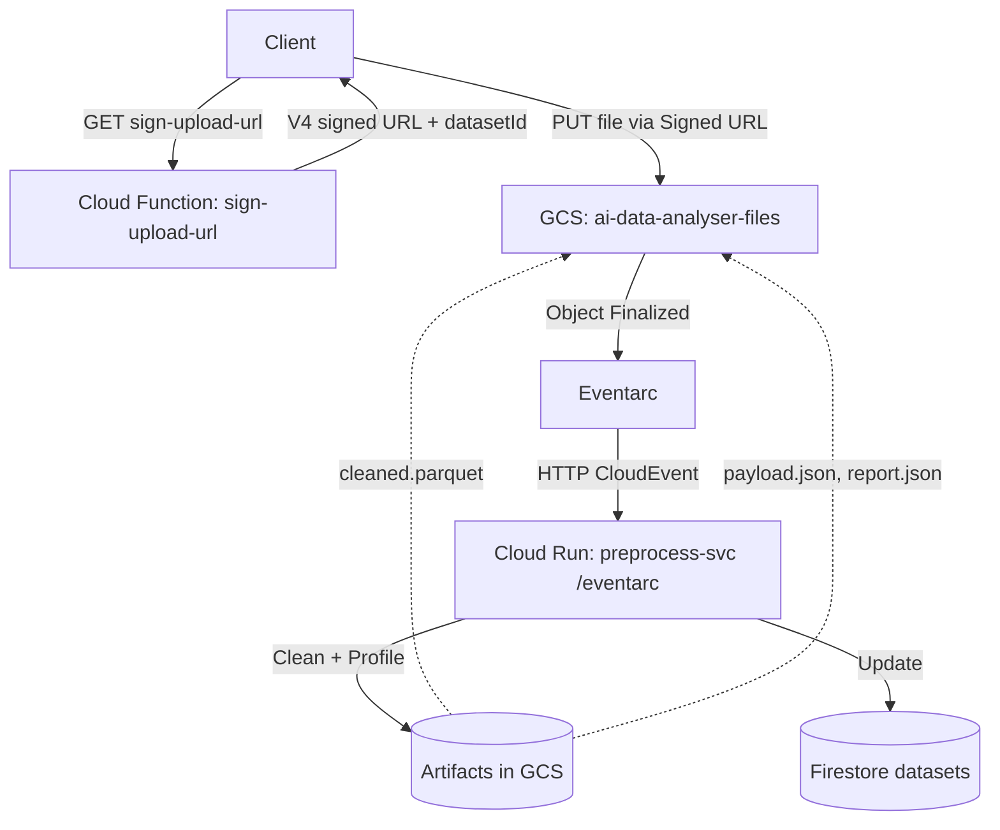

# AI Data Analyst – Progress Report

Date: 2025-09-26 10:55 (+03:00)

## Current Status
- **Preprocessing is fully functional**. Upload via signed URL triggers preprocessing; artifacts are generated and Firestore status advances to `ready`.
- **End-to-end smoke tests pass** using `test.ps1`.

## Deployed Components
- **Cloud Run service: `preprocess-svc`**
  - Framework: `FastAPI` in `backend/run-preprocess/main.py`.
  - Endpoints:
    - `GET /healthz` – lightweight health endpoint (service is private; unauthenticated calls may 403/404).
    - `POST /eventarc` – Eventarc target; parses CloudEvents in multiple delivery shapes (structured, binary, Pub/Sub push, and GCS notification compatibility).
  - Responsibilities:
    - Download raw file from GCS under `users/{uid}/sessions/{sid}/datasets/{datasetId}/raw/input.{csv|xlsx}`.
    - Run pipeline `backend/run-preprocess/pipeline_adapter.py` to clean and profile data.
    - Write artifacts:
      - `cleaned/cleaned.parquet`
      - `metadata/payload.json`
      - `reports/cleaning_report.json`
    - Update Firestore dataset document with `status: ready`, rows, columns, and artifact URIs.
  - Observability: integrates Google Cloud Logging (`cloud-logging: configured`).

- **Cloud Functions (Gen2): `sign-upload-url`**
  - Path: `backend/functions/sign_upload_url/main.py`.
  - Functionality: issues a V4 signed URL for direct browser PUT upload.
  - Security: uses IAM-based signing via impersonated credentials (no private key).
  - Behavior: creates initial Firestore dataset doc with `status: awaiting_upload` and `ttlAt`.

- **Cloud Functions (Gen2): `chat` (orchestrator, SSE)**
  - Path: `backend/functions/orchestrator/` (deployed and available; orchestration logic outside the scope of this stage).

- **Eventarc Trigger: `preprocess-trigger`**
  - Filters: `type=google.cloud.storage.object.v1.finalized`, `bucket=ai-data-analyser-files`.
  - Destination: Cloud Run `preprocess-svc` path `/eventarc` (region `europe-west4`).
  - Transport: Pub/Sub (managed subscription/topic).

- **Google Cloud Storage (GCS)**
  - Bucket: `ai-data-analyser-files`.
  - Structure per dataset:
    - `raw/input.csv` (or `.xlsx`)
    - `cleaned/cleaned.parquet`
    - `metadata/payload.json`
    - `reports/cleaning_report.json`

- **Firestore (Native mode)**
  - Collection path: `users/{uid}/sessions/{sid}/datasets/{datasetId}`.
  - Fields (subset): `status`, `rawUri`, `cleanedUri`, `payloadUri`, `reportUri`, `rows`, `columns`, `updatedAt`, `ttlAt`.
  - TTL Policy: Enabled on collection group `datasets` for field `ttlAt` (state: ACTIVE).

## Architecture & Design
- **Design principles**
  - Keep compute stateless and ephemeral; persist state/artifacts in Firestore + GCS.
  - Use direct-to-GCS uploads via signed URLs; minimize function runtime and egress.
  - Eliminate private keys; prefer IAM-based signing and workload identity.
  - Event-driven preprocessing via Eventarc to decouple upload from processing.

- **High-level flow**

- **Security & IAM**
  - Runtime Service Account: `${PROJECT_NUMBER}-compute@developer.gserviceaccount.com`.
  - Roles:
    - `roles/datastore.user` for Firestore access.
    - Bucket-scoped `roles/storage.objectAdmin` on `ai-data-analyser-files`.
    - `roles/eventarc.eventReceiver` for Eventarc delivery.
    - `roles/iam.serviceAccountTokenCreator` (self) for IAM-based signing.
    - GCS service account granted `roles/pubsub.publisher` for CloudEvents → Pub/Sub.
  - Cloud Run service is private; HTTP access requires identity.

  - Script: `backend/deploy.ps1` handles:
    - Enabling APIs.
    - Deploying Cloud Run `preprocess-svc` with buildpacks (Python 3.12).
    - Setting env vars: `FILES_BUCKET`, `GCP_PROJECT`, `TTL_DAYS`.
    - Creating/Updating Eventarc trigger.
  - Deploying Cloud Functions `sign-upload-url` and `chat`.
  - Printing service URLs and running a smoke test.

## Verification
- **Smoke test**: `test.ps1`
  - Health probe (best-effort; service is private so 404/403 is expected).
  - Requests signed URL, uploads sample CSV, waits 30s, lists artifacts, and prints Firestore `status`.

- **Logs**
  - Cloud Run: use `gcloud logging read 'resource.type="cloud_run_revision" AND resource.labels.service_name="preprocess-svc"' --limit=100 --freshness=1h`.
  - Indicators of successful processing: `preprocess_complete` log entry and 204 response to `/eventarc` after processing.

## Operational Notes
- **Known non-blocker**: `/healthz` unauthenticated requests return 404/403 because the service is private. This does not affect Eventarc-triggered processing.
- **Resource tuning** (optional): set Cloud Run `--concurrency=1` and increase `--memory` (e.g., 1Gi) if needed for heavy files.
- **Idempotency** (optional): skip reprocessing if `cleaned/` already exists.
- **Bucket lifecycle** (optional): add object TTL for `users/` prefix to match Firestore TTL.

## Recent Changes (Changelog)
- **2025-09-27**
  - Standardized on `backend/deploy.ps1` as the only deployment method.
  - Removed `backend/cloudbuild.yaml` and all documentation references to Cloud Build.
  - Updated `README.md` and `backend/run-preprocess/README.md` accordingly.
- **2025-09-26 (later)**
  - Repository restructure: moved backend components under `backend/`.
  - Updated `backend/deploy.ps1` and `backend/test.ps1` to use script-relative paths.
  - Added unified CI/CD at `backend/cloudbuild.yaml` (deprecated on 2025-09-27).
- **2025-09-26**
  - Deployed `preprocess-svc` rev `preprocess-svc-00005-w5c` via `deploy.ps1`.
  - Verified end-to-end: artifacts generated and Firestore updated to `ready`.
- **2025-09-25**
  - `sign-upload-url`: switched to V4 signed URLs using impersonated credentials; removed private key reliance.
  - `run-preprocess/main.py`: implemented robust CloudEvent parsing for `/eventarc`; added `/healthz`.
  - `test.ps1`: increased wait to 30s; added Firestore status fetch.
  - Firestore TTL policy enabled for `datasets` on `ttlAt` (ACTIVE).

## Next Steps
- **Optional**: authenticate health probe in scripts with identity tokens if you want a green check.
- **Optional**: apply Cloud Run resource tuning if processing larger files.
- **Upcoming**: integrate chat/orchestrator stage to consume `payload.json` and cleaned data.

---

This file is the living progress record for this project. Update it with each change to deployments, architecture, or operational practice.
