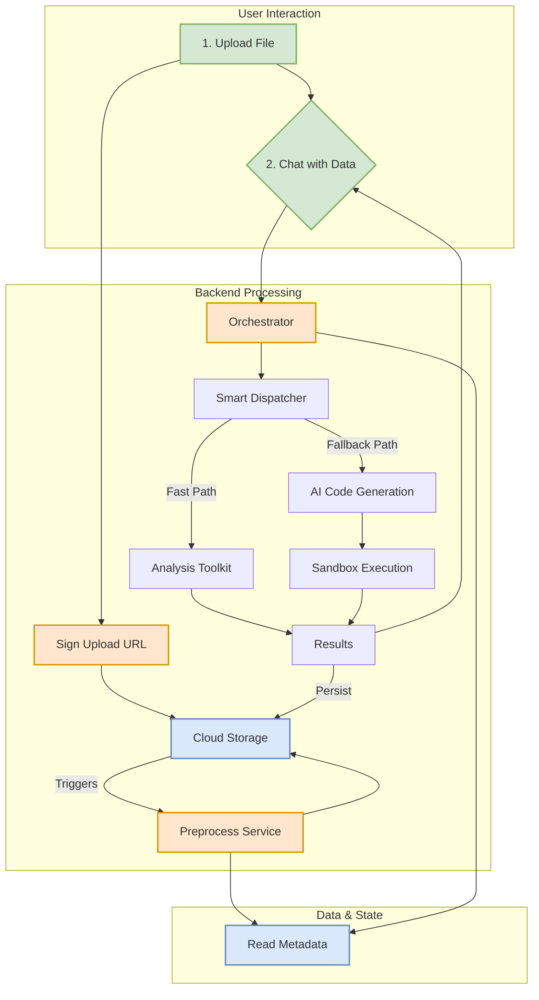

# AI Data Analyst

AI Data Analyst is a smart application that lets you upload your data files (like CSVs or Excel sheets) and then ask questions about them in plain English. The app analyzes your data and gives you back summaries, tables, and charts to help you understand it.

It's built to be secure and efficient, running on Google Cloud. You can upload files directly and get your analysis in real-time, all through a simple chat interface.

## How It Works

The application follows a simple, automated workflow from the moment you upload a file to when you receive your analysis:

1.  **Secure Upload**: When you want to upload a file, the application first generates a special, secure link for you. This link lets you upload your file directly to a private Google Cloud Storage bucket without the file ever passing through our servers. This is a fast and secure way to handle your data.

2.  **Automatic Preprocessing**: Once your file is uploaded, a process automatically kicks in to clean, analyze, and standardize your data. It figures out the data types in each column, gathers statistics, and converts your file into an efficient format (Parquet) that's ready for analysis.

3.  **Chat with Your Data**: After your file is processed, you can start asking questions through the chat window. For example, you could ask, "What are the total sales by region?" or "Show me the top 10 best-selling products."

4.  **Smart Analysis**: When you ask a question, the application's "Orchestrator" decides on the best way to answer it:
    *   **Fast Path**: For common questions (like summing a column or sorting data), it uses a set of pre-built, highly efficient tools to get your answer almost instantly.
    *   **Fallback Path**: For more complex questions, it uses a powerful AI model (Gemini) to write and run Python code to perform the analysis. This code runs in a secure, sandboxed environment to keep everything safe.

5.  **Real-Time Results**: As the analysis is happening, the application sends you real-time updates. When it's done, you'll get a summary of the findings, along with any tables or charts that were generated. All the results are saved, so you can always come back to them later.

## Workflow Diagram

Here’s a diagram that shows how data flows through the system:



## Core Components

The application is made up of a few key components that work together:

*   **Sign Upload URL Function**: This is the gatekeeper for file uploads. It checks that you're authorized to upload a file and then gives you a secure, one-time link to upload it directly to cloud storage.
*   **Preprocess Service**: This service automatically processes your raw data file. It cleans it up, figures out what kind of data is in it, and saves it in a standardized format that's optimized for analysis.
*   **Orchestrator Function**: This is the brain of the application. It takes your questions, decides whether to use the "Fast Path" or the "Fallback Path" for analysis, and then coordinates the work to get you an answer. It also streams results back to you in real-time.
*   **Analysis Toolkit**: This is a collection of pre-written, highly optimized functions for common analysis tasks like filtering, sorting, and aggregating data. It's the engine behind the "Fast Path."
*   **Gemini AI Client**: For complex questions, the orchestrator uses this client to talk to Google's Gemini AI model, which generates Python code on the fly to analyze your data.
*   **Sandbox Runner**: To ensure security, any AI-generated code is first validated and then run in a secure, isolated sandbox. This prevents the code from doing anything it's not supposed to.
*   **Firestore Database**: The app uses Firestore to keep track of your files, their processing status, and the history of your chat sessions.

## Key Business Rules

Here are some of the important rules the application operates by:

*   **File Size Limit**: You can upload files up to **20 MB**.
*   **Allowed File Types**: The application accepts common data files like **CSV (.csv)** and **Excel (.xls, .xlsx)**.
*   **Data Retention**: To manage storage, all uploaded files and their associated data are automatically scheduled for deletion **1 day** after they are uploaded. This is a default setting that can be configured.
*   **Secure Access**: All interactions with the application require authentication, ensuring that only you can access your data and analysis history.

## Configuration (Environment Variables)

The application's behavior can be customized using environment variables. Here are some of the most important ones for the backend:

| Variable | Description | Default |
| --- | --- | --- |
| `FILES_BUCKET` | The name of the Google Cloud Storage bucket where files are stored. | `ai-data-analyser-files` |
| `ALLOWED_ORIGINS` | A comma-separated list of web domains that are allowed to access the application. | `http://localhost:5173,https://ai-data-analyser.web.app,...` |
| `MAX_FILE_BYTES` | The maximum allowed file size for uploads, in bytes. | `20971520` (20 MB) |
| `TTL_DAYS` | The number of days before uploaded files and their metadata are automatically deleted. | `1` |
| `FASTPATH_ENABLED` | A flag to turn the "Fast Path" analysis on or off. | `true` |
| `FALLBACK_ENABLED` | A flag to turn the AI-driven "Fallback Path" on or off. | `true` |
| `CHAT_HARD_TIMEOUT_SECONDS`| The maximum time allowed for a chat analysis to run before it times out. | `60` |
| `CODEGEN_TIMEOUT_SECONDS`| The maximum time the AI is given to generate Python code. | `30` |

---

## For Developers

This section contains more technical details for developers working on the project.

### Repository Layout

-   **`backend/`**: Contains all the Google Cloud services.
    -   `functions/`: Gen2 Cloud Functions for the main application logic.
        -   `sign_upload_url/`: Handles secure file uploads.
        -   `orchestrator/`: The main chat and analysis engine.
    -   `run-preprocess/`: A Cloud Run service for the data preprocessing pipeline.
-   **`frontend/`**: The web interface, built with Vite and React.

### Getting Started

1.  **Deploy Backend**: Use the PowerShell scripts in the `backend/` directory (`deploy-preprocess.ps1` and `deploy-analysis.ps1`) to deploy the services to your Google Cloud project.
2.  **Configure Frontend**:
    *   Copy `frontend/.env.example` to `frontend/.env.development`.
    *   Fill in the environment variables with your Firebase project configuration and the URLs for your deployed backend functions.
3.  **Run Locally**:
    ```bash
    # In the frontend directory
    npm install
    npm run dev
    ```

### Design Choices

-   **Direct-to-GCS Uploads**: We use signed URLs to let the user's browser upload files directly to Google Cloud Storage. This is more efficient and secure than routing files through a server.
-   **Event-Driven Architecture**: The preprocessing service is triggered by events from Cloud Storage, which decouples it from the upload process and makes the system more resilient.
-   **Serverless**: The entire backend runs on serverless platforms (Cloud Functions and Cloud Run), which means it scales automatically and you only pay for what you use.
-   **Impersonated Credentials**: The application uses IAM service account impersonation to generate signed URLs, which avoids the need to manage and store long-lived private keys.

### UI/UX Features

-   **ChatGPT-Style Interface**: Clean, minimal design with seamless table and chart integration.
-   **Smart Pagination**: Tables display 25 rows per page with elegant Previous/Next navigation, supporting up to 200 rows total.
-   **Adaptive Formatting**: Numbers are formatted intelligently (no decimals for values ≥1000, 2 decimals for smaller values).
-   **Right-Aligned Numbers**: Numeric columns are automatically right-aligned for better readability.
-   **Theme Support**: Full light/dark mode support with theme-consistent colors throughout.
-   **Interactive Tables**: Sortable columns with visual indicators, hover effects, and sticky headers.

### Known Limitations

-   If the AI model returns an empty `metrics` object, it is persisted as is. The system only auto-fills metrics if the field is missing entirely.
-   Charts are optional. If the analysis doesn't produce a chart, the corresponding data file may be empty.
-   Table display is limited to 200 rows maximum (configurable in backend).


