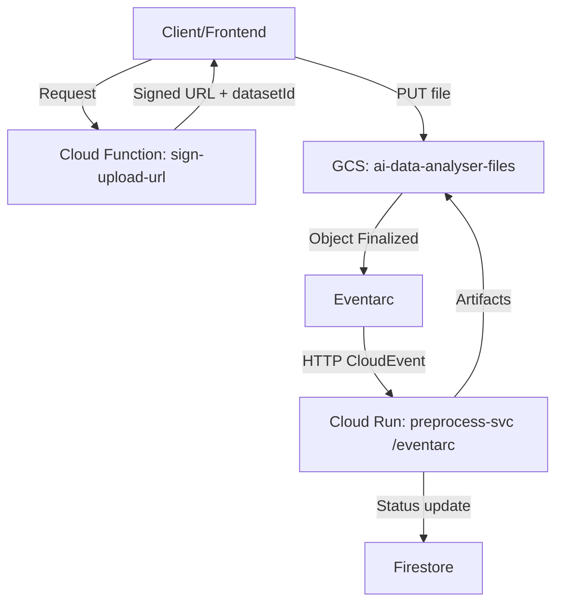

# AI Data Analyst

AI Data Analyst is a serverless, event-driven pipeline that lets users upload data files directly to Google Cloud Storage and automatically preprocesses them into clean, analysis-ready artifacts. The system persists metadata and results to Firestore and GCS and is designed for reliability, security, and low operational overhead.

## What this project does
- Issues secure, short-lived signed URLs for direct uploads from the client to GCS.
- Listens for object-finalize events and triggers a preprocessing service.
- Cleans, profiles, and converts uploaded data into standard artifacts (Parquet + JSON payload/report).
- Stores dataset metadata and status in Firestore for downstream consumption.

## Key components
- `functions/sign_upload_url/` – Cloud Function (Gen2) that validates upload requests and returns a V4 signed URL (PUT).
- `run-preprocess/` – Cloud Run service that receives Eventarc events and runs the preprocessing pipeline.
- Eventarc trigger – Routes GCS finalize events (on `ai-data-analyser-files`) to the Cloud Run `/eventarc` endpoint.
- Firestore – Stores dataset documents (status, URIs, summary) with TTL-based cleanup.
- GCS bucket `ai-data-analyser-files` – Stores raw uploads and generated artifacts.

## High-level workflow

## Design choices
- Direct-to-GCS uploads using signed URLs avoid proxying large payloads through app servers.
- Eventarc decouples ingestion from processing and enables reliable, at-least-once delivery.
- No private keys: V4 URL signing relies on IAM-based impersonated credentials.
- Stateless compute: Cloud Run function loads, processes, and writes artifacts; data/state live in GCS/Firestore.
- TTL cleanup: Firestore documents have a TTL policy; add GCS lifecycle rules as needed.

## Repository layout
- `backend/` – All deployable backend components
  - `functions/` – Serverless functions (Gen2)
    - `sign_upload_url/` – Signed URL issuance
    - `orchestrator/` – SSE chat/orchestrator (future/optional integration)
  - `run-preprocess/` – Cloud Run preprocess service (FastAPI), pipeline, and requirements
  - `deploy.ps1` – One-shot provisioning and deploy script (script-relative paths)
  - `test.ps1` – Local smoke test (upload + artifact/Firestore checks)
  - `cloudbuild.yaml` – Unified CI/CD pipeline for all backend components
- `docs/` – API drafts and operational notes
- `PROGRESS.md` – Ongoing progress log and architecture notes

## Getting started (quick)
1. Ensure you’re on the correct project and have gcloud configured.
2. One-shot deploy (manual):
   - `./backend/deploy.ps1`
   - Run `./backend/test.ps1` to upload a sample CSV and verify artifacts and Firestore status.
3. CI/CD (recommended):
   - Create a Cloud Build trigger pointing to `backend/cloudbuild.yaml`.
   - Configure substitutions if needed: `_PROJECT_ID`, `_REGION`, `_BUCKET`.

## Status
The preprocessing stage is fully functional. See `PROGRESS.md` for the latest changes and operational notes.
