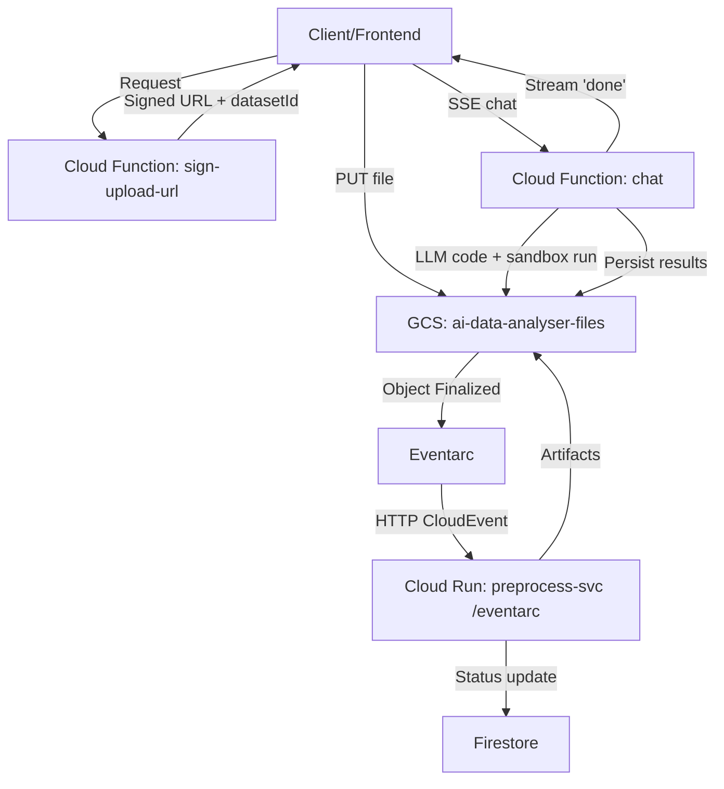

# AI Data Analyst

AI Data Analyst is a serverless, event-driven pipeline that lets users upload data files directly to Google Cloud Storage and automatically preprocesses them into clean, analysis-ready artifacts. It also provides a chat interface that generates and executes Python analysis against the preprocessed data and streams results to the client.

## What this project does
- Issues secure, short-lived signed URLs for direct uploads from the client to GCS.
- Listens for object-finalize events and triggers a preprocessing service.
- Cleans, profiles, and converts uploaded data into standard artifacts (Parquet + JSON payload/report).
- Stores dataset metadata and status in Firestore for downstream consumption.

## Key components
- `backend/functions/sign_upload_url/` – Cloud Function (Gen2) that validates upload requests (Firebase ID token) and returns a V4 signed URL (PUT).
- `backend/functions/orchestrator/` – Cloud Function (Gen2) that orchestrates analysis and streams SSE events while generating code, executing it in a sandbox, and persisting artifacts.
- `backend/run-preprocess/` – Cloud Run service that receives Eventarc events and runs the preprocessing pipeline.
- Eventarc trigger – Routes GCS finalize events (on `ai-data-analyser-files`) to the Cloud Run `/eventarc` endpoint.
- Firestore – Stores dataset documents (status, URIs, summary) with TTL-based cleanup.
- GCS bucket `ai-data-analyser-files` – Stores raw uploads and generated artifacts.

## High-level workflow


## Design choices
- Direct-to-GCS uploads using signed URLs avoid proxying large payloads through app servers.
- Eventarc decouples ingestion from processing and enables reliable, at-least-once delivery.
- No private keys: V4 URL signing relies on IAM-based impersonated credentials.
- Stateless compute: Cloud Run function loads, processes, and writes artifacts; data/state live in GCS/Firestore.
- TTL cleanup: Firestore documents have a TTL policy; add GCS lifecycle rules as needed.

## Repository layout
- `backend/` – All deployable backend components
  - `functions/` – Serverless functions (Gen2)
    - `sign_upload_url/` – Signed URL issuance
    - `orchestrator/` – SSE chat/orchestrator
  - `run-preprocess/` – Cloud Run preprocess service (FastAPI), pipeline, and requirements
  - `deploy.ps1` – One-shot provisioning and deploy script (script-relative paths)
  - `test.ps1` – Local smoke test (upload + artifact/Firestore checks)
- `docs/` – API drafts and operational notes
 - `frontend/` – Vite + React app (Auth + Upload + Chat UI)
## Getting started (quick)
1. Ensure you’re on the correct project and have gcloud configured.
2. Deploy using scripts in `backend/` (preprocess + functions). For functions only, use `deploy-analysis.ps1`.
3. Optionally run `./backend/test.ps1` to upload a sample CSV and verify artifacts and Firestore status.

## Frontend

- Vite + React app under `frontend/` with:
  - Firebase Anonymous Auth (see `.env.example` and create `.env.local`).
  - File upload (paperclip) → `sign-upload-url` (signed PUT) → GCS → Eventarc → preprocess.
  - Chat UI that streams SSE from `chat` and posts an answer on `done`.

Dev setup:
```bash
cp frontend/.env.example frontend/.env.local
# Fill VITE_CHAT_URL, VITE_SIGN_URL, and Firebase web app config
npm install
npm run dev  # serves on http://localhost:5173
```

Important:
- CORS allowlist includes: `http://localhost:5173`, Firebase Hosting origins.
- Functions preflight allow lowercase headers (`authorization`, `content-type`, `x-session-id`).
- Frontend passes `sessionId` as a query param to avoid custom header preflight.

## Status
- Preprocessing stage: functional.
- Chat (SSE) orchestrator: functional with robust fallbacks in the worker to ensure valid result payloads.
- See `PROGRESS.md` for the latest changes and operational notes.

## Known limitations
- If the LLM returns an empty `metrics` object intentionally, we currently persist it as `{}`; the worker only auto-fills metrics when the field is missing or wrong type. We may change this behavior to always include basic row/column counts.
- Charts are optional; if not requested/returned, `chart_data.json` may be minimal or empty.
